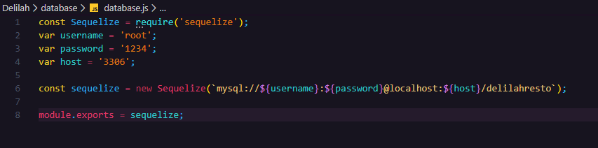

# Delilah Resto
_API REST para administrar los pedidos realizados a un restaurant creada con Node Framework y utilizando MySQL para almacenar  los datos._
> ## Comenzando :cohete:
_Estas instrucciones te permitirán obtener una copia del proyecto funcionando en tu máquina de manera local para propósitos de desarrollo y pruebas._
### Pre-requisitos :portapapeles:
_Programas recomendados para poder levantar el proyecto de forma local y realizar las pruebas._
* __Node__ v12.13.0
* __MySQL Workbench__ (con usuario y contraseña)
* __MySQL server__
* __Postman__
 >## Crear la base de datos :llave_de_tuerca: 
_Dentro del directorio principal del poyecto se encuentra una carpeta llamada __sql__ que contiene un archivo llamdo `delilahresto.sql` ._

_En este archivos encuentran todas las query necesarias para crear la base de datos llamada `Delilahresto` correspondiente al proyecto, ademas realiza una carga de datos mínima para que funcione el proyecto._
* Un usuario administrador, con nombre de usuario: admin y constraseña: admin
* 7 productos
* 6 estados para las ordenes
* 2 formas de pago
### Pasos
* 1- Abrir __MySQL Workbench__ y crear una nueva conexión configurando el host, usuario y contraseña.
* 2- Una vez dentro de la conexión, abrir el archivo `delilahresto.sql` y ejecutar todo el script.

> ## Configurando el server  :engranaje:
_Primero tenemos que configurar la conexión a la base de datos que creamos en el paso anterior._
_Para eso nos dirigimos al archivo de configuración que se encuentra en esta ruta `database/database.js` dentro del proyecto._

_Una vez dentro de ese archivo cambiar los valores de los campos `host` , `username` , `password` por los datos que correspondan a su base de datos (creada en el punto  anterior)._



_Guardar los nuevos datos y salir._

> ## Corriendo el servidor  :tuerca_y_perno:
_Lo primero que tenemos que hacer es, mediante una terminal, ir a la carpeta donde se encuentra el proyecto._
_Una vez allí corremos el siguiente comando para instalar todas las dependencias que el proyecto necesita._
```
npm install
```
_Luego ejecutamos este comando para **inicializar el server**._
```
npm run start
```
_Con estos pasos completos deberíamos tener el servidor corriendo y configurado para poder realizar las pruebas._
> ## Pruebas y test con Postman :martillo_y_llave_inglesa:
_Informacion importante para realizar las pruebas._
### Archivo YAML y Postman collection
_En el directorio principal del proyecto se encuentra una carpeta llamada `docs` en la cual se encuentra la documentacion de la API mediante un archivo llamado `spec.yaml` ._
_Ademas se incluye una coleccion de postman( `Delilah Resto.postman_collection.json` ) con todos los endpoints y formatos de datos para las request._
```

```
* ## Nota importante :página_boca_arriba:
_Este proyecto está configurado para usar tokens de autentificacion , que son requeridos para todos los endpoint del proyecto excepto para los de registro y login._
_Por lo tanto es recomendable primero testear el endpoint de registro de usuario, creando un usuario nuevo y luego con ese usuario loguearse, lo que le devolvera un token que podra ser usado para el header de atentificacion de los demas endpoint a los que usuario comun puede acceder._
_Por otro lado, la base de datos tiene cargado por defecto un usuario admin, para poder realizar las pruebas, para usarlo y obtener el token , hay que loguearse con usuario `admin` y contraseña `admin` mediante el endpoint de login._
## Autores :plumín_negro:
* **Brenda Natividad Manzano**
---
### Proyecto `Delila Resto` Acamica